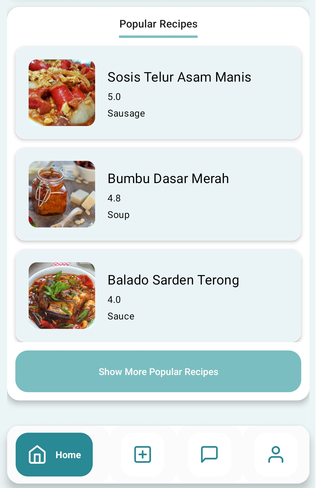
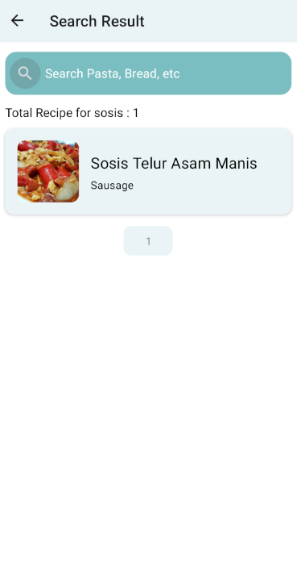
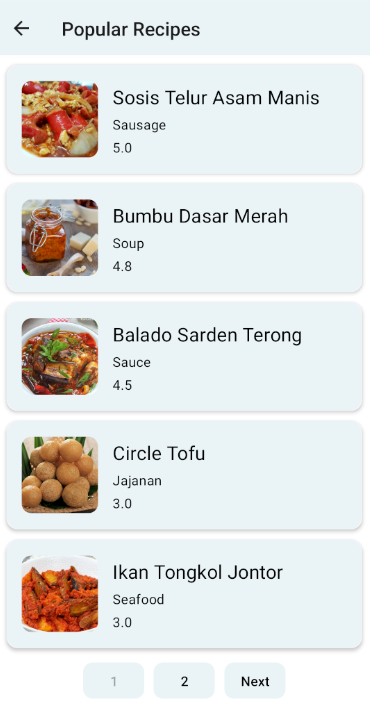
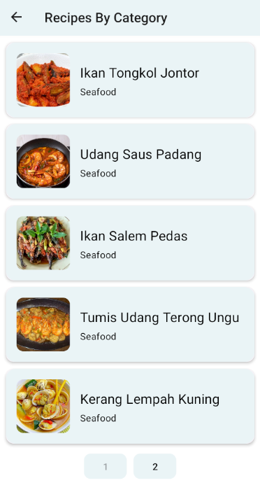
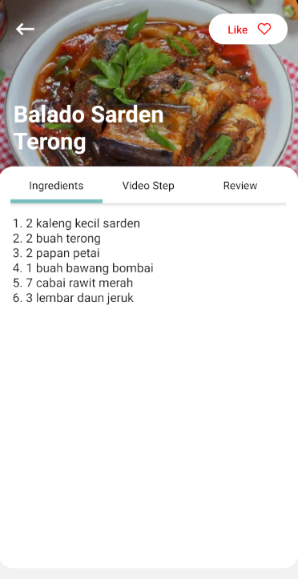
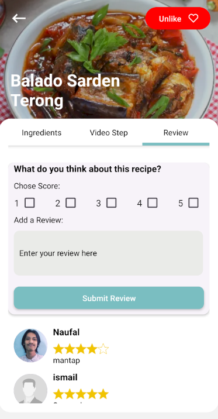

# Pijar Food Apps (Android)

# This Repository is about Pijar Food build with react native

Pijar food Apps is a application for viewing and sharing food recipes build with react native, redux toolkit and firebase

## Features

- Login/Register: Users can create accounts or log in to existing accounts.
- View Recipes: Users can browse and view various food recipes.
- View Recipes by Category: Recipes can be filtered by categories for easier navigation.
- Add Recipes: Registered users can add new recipes to the app.
- Like Recipes: Users can like their favorite recipes.
- Review Recipes: Users can rate and comment on recipes.
- Message between Users: Users can send messages to each other.
- View My Created Recipes: Registered users can see the recipes they have added.
- View My Liked Recipes: Users can see the recipes they have liked.
- Edit User's Photo and Info: Users can update their profile photo and information.

## The following tech stack is used in the project:

- react-native-async-storage/async-storage
- react-native-firebase/app
- react-navigation/stack
- reduxjs/toolkit
- axios
- react-native
- react-native-paper
- react-redux

# Getting Started

> **Note**: Make sure you have completed the [React Native - Environment Setup](https://reactnative.dev/docs/environment-setup) instructions till "Creating a new application" step, before proceeding.

- create .env file with
  API_URL=

## Step 1: Start the Metro Server

First, you will need to start **Metro**, the JavaScript _bundler_ that ships _with_ React Native.

To start Metro, run the following command from the _root_ of your React Native project:

```bash
# using npm
npm start

# OR using Yarn
yarn start
```

## Step 2: Start your Application

Let Metro Bundler run in its _own_ terminal. Open a _new_ terminal from the _root_ of your React Native project. Run the following command to start your _Android_ or _iOS_ app:

### For Android

```bash
# using npm
npm run android

# OR using Yarn
yarn android
```

### For iOS

```bash
# using npm
npm run ios

# OR using Yarn
yarn ios
```

If everything is set up _correctly_, you should see your new app running in your _Android Emulator_ or _iOS Simulator_ shortly provided you have set up your emulator/simulator correctly.

This is one way to run your app — you can also run it directly from within Android Studio and Xcode respectively.

## Step 3: Modifying your App

Now that you have successfully run the app, let's modify it.

1. Open `App.tsx` in your text editor of choice and edit some lines.
2. For **Android**: Press the <kbd>R</kbd> key twice or select **"Reload"** from the **Developer Menu** (<kbd>Ctrl</kbd> + <kbd>M</kbd> (on Window and Linux) or <kbd>Cmd ⌘</kbd> + <kbd>M</kbd> (on macOS)) to see your changes!

   For **iOS**: Hit <kbd>Cmd ⌘</kbd> + <kbd>R</kbd> in your iOS Simulator to reload the app and see your changes!

## Congratulations! :tada:

You've successfully run and modified your React Native App. :partying_face:

### Now what?

- If you want to add this new React Native code to an existing application, check out the [Integration guide](https://reactnative.dev/docs/integration-with-existing-apps).
- If you're curious to learn more about React Native, check out the [Introduction to React Native](https://reactnative.dev/docs/getting-started).

# Troubleshooting

If you can't get this to work, see the [Troubleshooting](https://reactnative.dev/docs/troubleshooting) page.

# Learn More

To learn more about React Native, take a look at the following resources:

- [React Native Website](https://reactnative.dev) - learn more about React Native.
- [Getting Started](https://reactnative.dev/docs/environment-setup) - an **overview** of React Native and how setup your environment.
- [Learn the Basics](https://reactnative.dev/docs/getting-started) - a **guided tour** of the React Native **basics**.
- [Blog](https://reactnative.dev/blog) - read the latest official React Native **Blog** posts.
- [`@facebook/react-native`](https://github.com/facebook/react-native) - the Open Source; GitHub **repository** for React Native.

# Screenshot

<table>
<tr>
    <td>Splash Screen1 Page</td>
    <td>Splash Screen2 Page</td>
</tr>
<tr>
<tr>
    <td>
        
    </td>
    <td> 
        
    </td>
</tr>
<tr>
    <td>Login Page</td>
    <td>Register Page</td>
</tr>
<tr>
    <td>
        
    </td>
    <td> 
        
    </td>
</tr>
<tr>
    <td>Home1 Page</td>
    <td>Home2 Page</td>
</tr>
<tr>
    <td>
    
    </td>
    <td> 
    
    </td>
</tr>
<tr>
    <td>Search Page</td>
    <td>Popular Page</td>
</tr>
<tr>
    <td>
    
    </td>
    <td> 
    
    </td>
</tr>
<tr>
    <td>Category Page</td>
    <td>Category Recipes Page</td>
</tr>
<tr>
    <td>
    
    </td>
    <td> 
    
    </td>
</tr>
<tr>
    <td>Detail Page Section Ingredients </td>
    <td>Detail Page Section Video</td>
    <td>Detail Page Section Review  </td>
</tr>
<tr>
    <td>
    
    </td>
    <td> 
    
    </td>
    <td> 
    
    </td>
</tr>
<tr>
    <td>Add New Recipe Page</td>
    <td>Add New Recipe2 Page</td>
</tr>
<tr>
    <td>
    
    </td>
    <td> 
    
    </td>
</tr>
<tr>
    <td>Message Page</td>
    <td>Chat Page</td>
</tr>
<tr>
    <td>
    
    </td>
    <td> 
    
    </td>
</tr>
<tr>
    <td>Authenticated Profile Page</td>
    <td>Not Authenticated Profile Page</td>
</tr>
<tr>
    <td> 
    
    </td>
    <td> 
    
    </td>
</tr>
</table>

# backend repositories

[Backend repository](https://github.com/nluthfis/PijarFood)

# Related Project

[`Pijar Food Web`](https://github.com/nluthfis/fe-react_pijarfood)

[`Demo Pijar Food Web`](https://fe-react-pijarfood.vercel.app)
